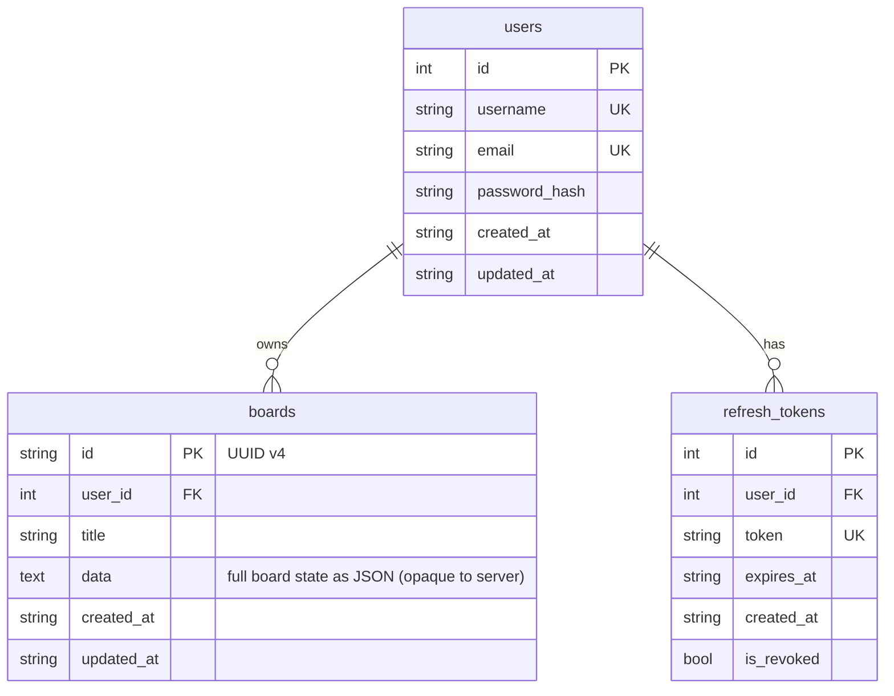

# h3xBoardServer

ASP.NET Core 10 backend for [h3xBoard](../h3xBoard) — a Flutter-based interactive whiteboard application.

## Tech stack

| Concern | Library |
|---|---|
| Transport | ASP.NET Core WebSockets |
| RPC | StreamJsonRpc (JSON-RPC 2.0) |
| ORM | linq2db |
| Migrations | FluentMigrator |
| Auth | JWT HS256 + BCrypt |
| Database | SQLite (MySQL / PostgreSQL ready) |

## Database schema



## API versioning

Two fully independent axes:

| Axis | Where | What it versions |
|---|---|---|
| **Transport** | URL — `/ws/v1`, `/ws/v2` | WebSocket handshake, message framing, RPC protocol — e.g. switching away from JSON-RPC entirely |
| **Service** | Method name — `auth.v1.*`, `auth.v2.*` | The API contract of a specific service group |

These axes are orthogonal. Examples of valid combinations:

| Setup | Meaning |
|---|---|
| `/ws/v1` → `AuthRpcV1` + `BoardsRpcV1` | Baseline |
| `/ws/v1` → `AuthRpcV1` + `AuthRpcV2` + `BoardsRpcV1` | Auth got a breaking change; old clients on `/ws/v1` still work via `auth.v1.*` |
| `/ws/v2` → `AuthRpcV1` + `BoardsRpcV1` | Transport changed, but both service APIs are unchanged |
| `/ws/v2` → `AuthRpcV1` + `AuthRpcV2` + `BoardsRpcV2` | Both axes bumped, v1 auth still available for compatibility |

Method names follow the pattern **`service.vN.action`** — e.g. `auth.v1.register`, `boards.v2.list`. The version in the name is required so that multiple class versions can be registered on the same endpoint without StreamJsonRpc seeing duplicate method names.

## Connecting

```
ws://<host>/ws/v1
```

To skip `auth.login` on reconnect, pass the access token as a query param — the server pre-authenticates before the first RPC call:

```
ws://<host>/ws/v1?token=<jwt>
```

Authentication state is per-connection and lives until the WebSocket is closed.

## Auth flow

```
Client                               Server
  │                                    │
  ├─── WS connect /ws/v1 ──────────► │
  │                                    │
  ├─── auth.register ───────────────► │ creates user, issues tokens
  │    or auth.login                   │
  │◄── { accessToken, refreshToken } ──┤ connection is now authenticated
  │                                    │
  ├─── boards.list ─────────────────► │ works because connection is authenticated
  │◄── [ { id, title, ... }, ... ] ───┤
  │                                    │
  ├─── auth.refreshToken ───────────► │ rotates the refresh token
  │◄── { accessToken } ───────────────┤
  │                                    │
  └─── WS disconnect ───────────────► │
  │                                    │
  ├─── WS connect /ws/v1?token=<jwt> ►│ pre-authenticated immediately
  │◄── (no extra call needed) ─────────┤
```

## JSON-RPC methods

All requests follow JSON-RPC 2.0:
```json
{ "jsonrpc": "2.0", "method": "auth.login", "id": 1, "params": { ... } }
```

### Auth

| Method | Auth required | Description |
|---|---|---|
| `auth.v1.register` | No | Create account, returns tokens |
| `auth.v1.login` | No | Sign in, returns tokens + marks connection authenticated |
| `auth.v1.refreshToken` | No | Rotate refresh token, returns new access token |
| `auth.v1.logout` | Yes | Revoke all refresh tokens |
| `auth.v1.whoami` | Yes | Returns `{ userId, username }` |

**auth.v1.register / auth.v1.login** — request:
```json
{ "jsonrpc": "2.0", "method": "auth.v1.register", "id": 1,
  "params": { "username": "alice", "email": "alice@example.com", "password": "secret123" } }
```
Response:
```json
{ "jsonrpc": "2.0", "id": 1,
  "result": { "accessToken": "...", "refreshToken": "...",
              "accessTokenExpiresInSeconds": 3600, "userId": 1, "username": "alice" } }
```

**auth.refreshToken** — request:
```json
{ "params": { "refreshToken": "<opaque-token>" } }
```

### Boards

All board methods require authentication.

| Method | Description |
|---|---|
| `boards.v1.list` | List all boards (summary only, no data blob), most-recently-updated first |
| `boards.v1.get` | Fetch one board including full JSON data blob |
| `boards.v1.create` | Create a board |
| `boards.v1.update` | Partial update — omit any field to leave it unchanged |
| `boards.v1.delete` | Permanently delete a board (no undo) |

**boards.v1.list** response:
```json
{ "result": [ { "id": "uuid", "title": "My Board", "createdAt": "...", "updatedAt": "..." } ] }
```

**boards.v1.create** request:
```json
{ "params": { "title": "My Board", "data": { "backgroundColor": 4294967295, "widgets": [] } } }
```

**boards.v1.update** request — send only what you want to change:
```json
{ "params": { "id": "uuid", "title": "Renamed" } }
{ "params": { "id": "uuid", "data": { ... } } }
{ "params": { "id": "uuid", "title": "New name", "data": { ... } } }
```

## Board data format

The `data` field is an **opaque JSON blob** — the server stores and returns it unchanged. The Flutter client owns the schema. Expected shape:

```json
{
  "backgroundColor": 4294967295,
  "isChalkboard": false,
  "linePattern": "none",
  "lineSpacing": 64.0,
  "lineColor": 4288256409,
  "drawingTools": {
    "activeTool": "pen",
    "penWidth": 2.0,
    "eraserWidth": 8.0,
    "lastActiveColor": 4278190080
  },
  "widgets": [
    {
      "id": "uuid",
      "x": 100.0, "y": 200.0,
      "rotation": 0.0, "scale": 1.0,
      "config": { "type": "clock", "use24h": true, "showSeconds": true }
    }
  ],
  "drawingStrokes": []
}
```

Colors are Dart `Color` ARGB integers (e.g. `0xFFFFFFFF` = 4294967295 = opaque white).

## Error codes

| Code | Meaning |
|---|---|
| 4001 | Unauthenticated — call `auth.login` first |
| 4002 | Invalid credentials |
| 4004 | Not found |
| 4009 | Conflict (e.g. username already taken) |
| 4022 | Validation error |
| 5000 | Internal server error |

## Configuration

`appsettings.json` / `appsettings.Production.json`:

```json
{
  "Database": {
    "Provider": "SQLite",
    "ConnectionString": "Data Source=h3xboard.db"
  },
  "Jwt": {
    "SecretKey": "replace-with-32+-char-random-secret",
    "Issuer": "h3xboard-server",
    "Audience": "h3xboard-client",
    "AccessTokenExpiryMinutes": 60,
    "RefreshTokenExpiryDays": 30
  }
}
```

> Generate a secure secret key before deploying:
> ```sh
> openssl rand -base64 32
> ```

## Running

```sh
dotnet run
# development (uses h3xboard-dev.db)
dotnet run --environment Development
```

Tables are created automatically on first start via FluentMigrator.

## Adding a database provider

1. Add the NuGet packages — e.g. for MySQL:
   ```xml
   <PackageReference Include="linq2db.MySql"                 Version="..." />
   <PackageReference Include="FluentMigrator.Runner.MySql"   Version="..." />
   ```
2. Uncomment the relevant `case` blocks in `Program.cs`
3. Set `Database:Provider` to `"MySQL"` in config
