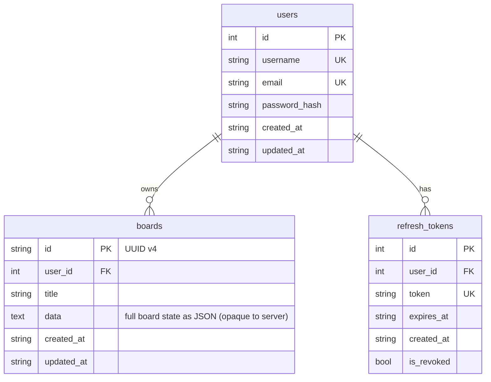

# h3xBoardServer

ASP.NET Core 10 backend for [h3xBoard](https://github.com/h3x4d3c1m4l/h3xBoard) — a Flutter-based interactive whiteboard application.

## Tech stack

| Concern | Library |
|---|---|
| Transport | ASP.NET Core WebSockets |
| RPC | StreamJsonRpc (JSON-RPC 2.0) |
| ORM | linq2db |
| Migrations | FluentMigrator |
| Auth | JWT HS256 + BCrypt |
| Database | SQLite (MySQL / PostgreSQL ready) |

## Database schema



## Documentation

Additional docs are in the [docs/](docs/) folder:

- [API versioning](docs/api-versioning.md)
- [Connecting & auth flow](docs/connecting-and-auth-flow.md)
- [JSON-RPC methods](docs/json-rpc-methods.md)
- [Error codes](docs/error-codes.md)
- [Adding a database provider](docs/adding-a-database-provider.md)

## Getting started

1. Generate a secret key:

   ```sh
   openssl rand -base64 32
   ```

   Add it to `appsettings.Development.json`:

   ```json
   { "Jwt": { "SecretKey": "<generated-key>" } }
   ```

2. Run the server:

   ```sh
   dotnet run --environment Development
   ```

   This uses `h3xboard-dev.db`. Tables are created automatically on first start via FluentMigrator.

For production, configure `appsettings.Production.json`:

```json
{
  "Database": {
    "Provider": "SQLite",
    "ConnectionString": "Data Source=h3xboard.db"
  },
  "Jwt": {
    "SecretKey": "replace-with-32+-char-random-secret",
    "Issuer": "h3xboard-server",
    "Audience": "h3xboard-client",
    "AccessTokenExpiryMinutes": 60,
    "RefreshTokenExpiryDays": 30
  }
}
```
