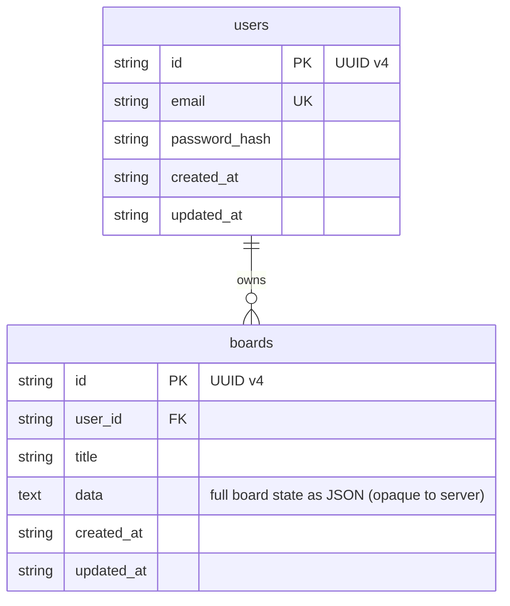

# h3xBoardServer

ASP.NET Core 10 backend for [h3xBoard](https://github.com/h3x4d3c1m4l/h3xBoard) — a Flutter-based interactive whiteboard application.

## Tech stack

| Concern | Library |
| --- | --- |
| Transport | ASP.NET Core WebSockets |
| RPC | StreamJsonRpc (JSON-RPC 2.0) |
| ORM | linq2db |
| Migrations | FluentMigrator |
| Auth | ASP.NET Core sessions + BCrypt |
| Database | SQLite (MySQL / PostgreSQL ready) |

## Database schema



## Documentation

Additional docs are in the [docs/](docs/) folder:

- [API versioning](docs/api-versioning.md)
- [Connecting & auth flow](docs/connecting-and-auth-flow.md)
- [JSON-RPC methods](docs/json-rpc-methods.md)
- [Error codes](docs/error-codes.md)
- [Adding a database provider](docs/adding-a-database-provider.md)

## Getting started

1. Run the server:

   ```sh
   dotnet run --environment Development
   ```

   This uses `h3xboard-dev.db`. Tables are created automatically on first start via FluentMigrator. No secret key is required — authentication uses ASP.NET Core sessions backed by an HTTP-only cookie.

2. Add your client's origin to `Cors:AllowedOrigins` in `appsettings.Development.json` so the browser will send the session cookie cross-origin (wildcards are not allowed because session cookies require `AllowCredentials()`):

   ```json
   { "Cors": { "AllowedOrigins": ["http://localhost:8080"] } }
   ```

For production, configure `appsettings.Production.json`:

```json
{
  "Database": {
    "Provider": "SQLite",
    "ConnectionString": "Data Source=h3xboard.db"
  },
  "Auth": {
    "SessionIdleTimeoutDays": 30,
    "AllowRegistration": true
  },
  "Cors": {
    "AllowedOrigins": ["https://your-client.example.com"]
  }
}
```

See [docs/connecting-and-auth-flow.md](docs/connecting-and-auth-flow.md) for the full authentication flow and the unauthenticated `GET /api/v1/server/info` capabilities endpoint.
